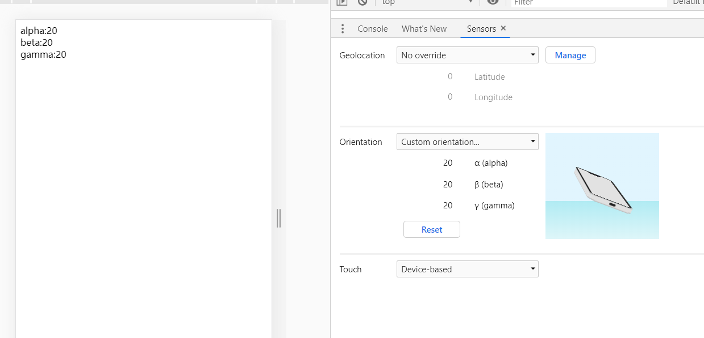
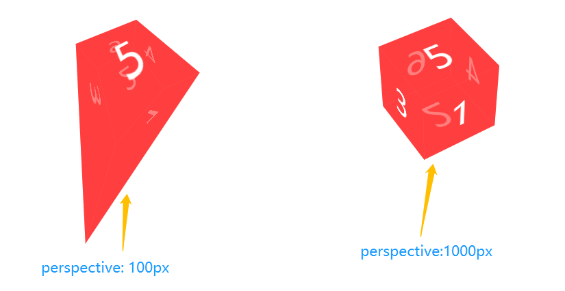
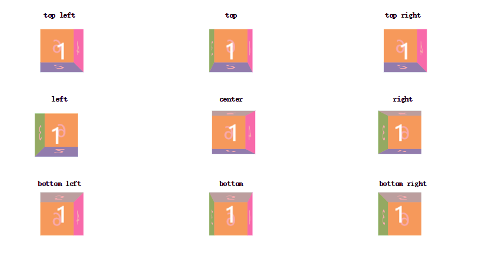
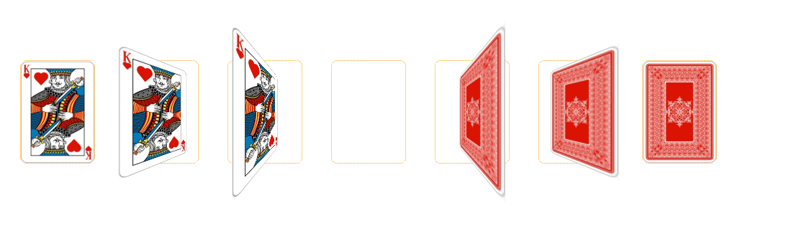

# css3 3D 

# 知识点
  1. 一些做的好的css3D网站
  2. H5 陀螺仪
  3. css3 3D 模型和应用 
  4. 结合touch事件
  5. css3D库
  6. js类库
## 一、一些做的号的css3D网站
现代的网页 视频占比比较多 好的网站的前提是好的创意
1. [https://720yun.com/](https://720yun.com/)  css3 实现的。
2. [http://h5doo.com/](http://h5doo.com/) 
## 二、H5 陀螺仪
> 陀螺仪又叫角速度传感器，在手机上包括3个值 alpha，beta和gamma
  1. alpha 取值: 0deg到360deg  围绕Z轴旋转的角度
  2. beta 取值: -180deg到180deg  围绕X轴旋转的角度
  3. gamma 取值: -90deg到90deg  围绕Y轴旋转的角度
```html
<!doctype html>
<html lang="en">
<head>
    <meta charset="UTF-8">
    <meta name="viewport"
          content="width=device-width, user-scalable=no, initial-scale=1.0, maximum-scale=1.0, minimum-scale=1.0">
    <meta http-equiv="X-UA-Compatible" content="ie=edge">
    <title>陀螺仪测试</title>
</head>
<body>
alpha:<span id="alpha"></span><br/>
beta:<span id="beta"></span><br/>
gamma:<span id="gamma"></span><br/>
</body>
<script>
    if (window.DeviceOrientationEvent) {
        window.addEventListener('deviceorientation', function (event) {
            var a = document.getElementById('alpha'),
                b = document.getElementById('beta'),
                g = document.getElementById('gamma'),
                alpha = event.alpha,
                beta = event.beta,
                gamma = event.gamma;
 
            a.innerHTML = Math.round(alpha);
            b.innerHTML = Math.round(beta);
            g.innerHTML = Math.round(gamma);
 
        }, false);
    } else {
        document.querySelector('body').innerHTML = '你的浏览器不支持陀螺仪';
    }
</script>
```  
chrome里面测试效果:


```javascript
  // 罗盘校准
  window.addEventListener('compassneedscalibration',function(event){
    alert('您的罗盘需要校准');
    event.preventDefault();
  },true) 
```
一些小应用
1. 摇一摇 的 实现
2. 指南针 的 实现
## 三、css3 3D 模型和应用 
### 3.1 css3 3D 基础知识
  1. transform-style属性 ◆ 需要设置在父元素中，并且高于任何嵌套的变形元素。
```css
 transform-style: falt | preserve-3d 
 /* 
   falt: 默认值，所有子元素在2D品面呈现
   preserve-3d: 所有的子元素位于3D空间
  */
```
 [transform-style demo翻转](./code/transform-style.html)
  
  2. perspective属性与perspective()函数

  perspective属性对于3D变形来说很重要，该属性会设置查看者的位置，并将可视内容映射到一个视锥上，继而投到一个2D视平面上。
  对于perspective属性，可以简单理解为视距，用来设置用户和元素3D空间Z平面之间的距离，效果由其值决定

```css
   perspective:none | <length>
   transform: prespective(none | length) /*length必须大于0*/
   /* 区别:  
   *  1.perspective属性要设置在 父元素上【舞台元素】
      2. perspective() 函数可以用在当前变形元素上
   */
```
 [ perspective 的值为100px 和 1000px 的3D立方体效果代码链接，如下](./code/perspective.html)

 
  
  3. perspective-origin 属性 ◆ 该属性必须定义在父元素上【舞台上】 也就是说要和perspective一起使用。

  perspective-origin 属性 主要用来决定perspective属性的源点角度，设置了x轴和y轴的位置 
  默认值 50% 50% （center）
  

  [perspective-origin 对立方体的影响](./code/perspective-origin.html)

  

  4. backface-visibility 属性
  backface-visibility 属性决定元素旋转背面是否可见。对于未旋转的元素，该元素的正面面向观看者，当其Y轴旋转180度时会导致元素背面面对观众。
```css
  backface-visibility: visible | hidden
  /* 
     visibel: 反面可见
     hidden ： 反面不可见
   */
```
[backface-visibility](./code/backface-visibility.html)

### 3.2 css3 3D 的各种应用
#### 3.2.1 css3D立方体的实现
#### 3.2.2 css3D立方体的实现
#### 3.2.3 css3D立方体的实现
#### 3.2.4 css3D立方体的实现
#### 3.2.5 css3D立方体的实现
#### 3.2.6 css3D立方体的实现
#### 3.2.7 css3D立方体的实现
# 小结